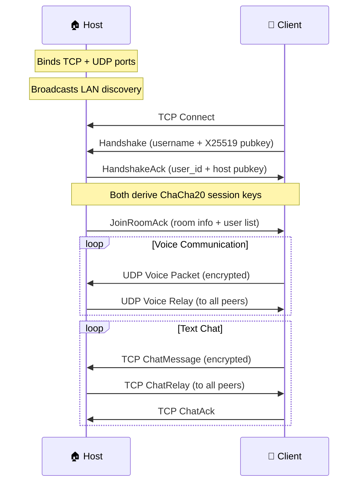

<div align="center">

# 🔊 Voxlink

### Zero-Server Voice & Chat — Built From Scratch in Rust

[](https://www.rust-lang.org/)
[](LICENSE)
[](/)
[](/)
[](/)

**A fully custom peer-to-peer voice & text communication app.  
No WebRTC. No WebSockets. No cloud. No bullshit.**

Every single byte of the networking stack, encryption layer, audio pipeline, and codec integration was written from the ground up. This is what happens when you refuse to `npm install` your way out of a problem.

[Features](#-features) · [Architecture](#-architecture) · [Getting Started](#-getting-started) · [How It Works](#-how-it-works) · [Contributing](#-contributing)

</div>

---

## 🤯 Why Does This Exist?

Every voice chat app you use — Discord, Teams, Zoom — relies on massive cloud infrastructure, WebRTC, and third-party SDKs. **What if you could do it all with zero servers?**

Voxlink proves it's possible. One machine hosts. Others join. Voice and text flow directly between peers with military-grade encryption. All built from scratch in Rust.

| Feature | Discord | Zoom | Voxlink |
|---------|---------|------|---------|
| Requires server | ✅ | ✅ | ❌ |
| Requires account | ✅ | ✅ | ❌ |
| Requires internet* | ✅ | ✅ | ❌ |
| End-to-end encrypted | ❌ | Partial | ✅ |
| Open source | ❌ | ❌ | ✅ |
| Custom protocol | ❌ | ❌ | ✅ |
| Data stored locally | ❌ | ❌ | ✅ |
| Binary size | 300MB+ | 200MB+ | ~15MB |

_*Voxlink works on LAN with zero internet. For WAN, users just need port forwarding._

---

## ✨ Features

🎙️ **Real-time Voice Communication** — Sub-50ms latency with Opus codec at 48kHz  
🔐 **Military-grade Encryption** — X25519 key exchange + ChaCha20-Poly1305 per session  
💬 **Encrypted Text Chat** — Messages encrypted in transit, stored locally in SQLite  
🏠 **Serverless Architecture** — One user hosts, others join. No cloud. No accounts.  
🔍 **LAN Auto-Discovery** — Rooms appear automatically on your local network  
🎛️ **Adaptive Audio** — Jitter buffer, voice activity detection, packet loss concealment  
🖥️ **Native Desktop App** — Tauri 2 shell, ~15MB, instant startup  
🎨 **Premium Dark UI** — Glassmorphism, gradient accents, micro-animations  
📦 **One-click Install** — MSI and NSIS installers included  

---

## 🏗️ Architecture

Voxlink is built as a **Rust workspace** with 4 specialized crates:

```
voxlink/
├── crates/
│   ├── chatcall-net/       # 🌐 Custom networking protocol & encryption
│   ├── chatcall-audio/     # 🎵 Audio capture, codec, mixing pipeline
│   └── chatcall-core/      # 🧠 Room management, chat, storage
└── app/
    ├── src-tauri/          # ⚡ Tauri 2 desktop backend
    └── src/                # 🎨 Frontend (HTML/CSS/JS)
```

### The Protocol Stack

```
┌─────────────────────────────────────────────────┐
│                 Application Layer                │
│         Room Management · Chat · Events          │
├─────────────────────────────────────────────────┤
│               Encryption Layer                   │
│    X25519 Key Exchange · ChaCha20-Poly1305       │
├─────────────────────────────────────────────────┤
│              Reliability Layer                   │
│       ACK Tracking · Message Ordering            │
├─────────────────────────────────────────────────┤
│              Transport Layer                     │
│     TCP (Control/Chat) · UDP (Voice Data)        │
├─────────────────────────────────────────────────┤
│              Protocol Layer                      │
│   Custom Binary Format · 8-byte Packet Header    │
│        Magic: 0xCC 0xAA · Version: 1            │
└─────────────────────────────────────────────────┘
```

### Voice Pipeline

```
Mic → [20ms frames] → VAD → Opus Encode (32kbps) → Encrypt → UDP ──→ Host
                                                                       │
Host ←── UDP → Decrypt → Jitter Buffer → Opus Decode/PLC → Mixer → Speaker
```

### Connection Flow



---

## 🚀 Getting Started

### Prerequisites

- **Rust** 1.70+ with MSVC toolchain
- **CMake** (for Opus codec compilation)
- **MSVC Build Tools** (Windows)

### Build from Source

```bash
# Clone the repo
git clone https://github.com/YOUR_USERNAME/Voxlink.git
cd Voxlink

# Set environment (Windows — required for Opus build)
$env:CARGO_TARGET_DIR = "C:\cargo-target\voxlink"
$env:CMAKE_POLICY_VERSION_MINIMUM = "3.5"

# Run tests (47 tests across 3 crates)
cargo test --workspace --exclude chatcall-app

# Build the desktop app
cargo tauri build --debug

# Installers will be at:
# → C:\cargo-target\voxlink\debug\bundle\msi\ChatCall_0.1.0_x64_en-US.msi
# → C:\cargo-target\voxlink\debug\bundle\nsis\ChatCall_0.1.0_x64-setup.exe
```

### Quick Start

1. **Host a room** — Open Voxlink → Enter your name → Create Room
2. **Join a room** — Open Voxlink on another machine → Enter host IP → Join
3. **Talk** — That's it. No accounts. No servers. No setup.

---

## 🔬 How It Works

### Custom Binary Protocol

Every packet uses a compact 8-byte header — no JSON overhead, no protobuf dependency:

```
┌──────┬─────────┬────────────┬──────────┐
│ 0xCC │ 0xAA    │ Version(1) │ Type(1)  │
│ Magic bytes    │            │          │
├──────┴─────────┼────────────┴──────────┤
│ Payload Length │ (4 bytes, little-end)  │
└────────────────┴───────────────────────┘
```

**12 packet types:** Handshake, HandshakeAck, JoinRoom, JoinRoomAck, LeaveRoom, ChatMessage, ChatAck, VoiceData, Ping, Pong, DiscoveryAnnounce, MuteStateChanged

### Encryption

Every session gets unique encryption keys via Diffie-Hellman:

1. Both peers generate ephemeral **X25519** keypairs
2. Exchange public keys during handshake
3. Derive **shared secret** via ECDH
4. Use HKDF to derive **separate send/recv keys**
5. All data encrypted with **ChaCha20-Poly1305** (AEAD)
6. Monotonic nonce counter prevents replay attacks

### Audio Pipeline

| Component | Technology | Purpose |
|-----------|-----------|---------|
| Capture | cpal | Cross-platform mic input, 20ms frames |
| Codec | Opus @ 32kbps | VoIP-optimized, Forward Error Correction |
| VAD | RMS Energy | Detects speech vs silence with hysteresis |
| Jitter Buffer | Adaptive BTreeMap | Reorders packets, EMA-based depth |
| PLC | Opus built-in | Conceals packet loss with interpolation |
| Mixer | Additive + tanh | Mixes N users with soft-clip to prevent distortion |
| Playback | cpal | Speaker output via ring buffer |

---

## 🧪 Test Suite

```
$ cargo test --workspace

chatcall-net    ✅ 33 tests — protocol, crypto, codec, reliability, serialization
chatcall-audio  ✅ 11 tests — jitter buffer, mixer, voice activity detection
chatcall-core   ✅  3 tests — chat history, SQLite storage
────────────────────────
Total           ✅ 47 tests — ALL PASSING
```

---

## 📁 Project Structure

```
├── Cargo.toml                          # Workspace config
├── crates/
│   ├── chatcall-net/                   # Networking library
│   │   └── src/
│   │       ├── protocol/               # Binary packet format + codec
│   │       ├── transport/              # TCP + UDP channels  
│   │       ├── crypto/                 # X25519 + ChaCha20-Poly1305
│   │       ├── reliability/            # ACK tracking + ordering
│   │       ├── discovery/              # LAN broadcast discovery
│   │       └── serialization/          # Binary encode/decode helpers
│   │
│   ├── chatcall-audio/                 # Audio pipeline
│   │   └── src/
│   │       ├── capture.rs              # Mic input (cpal)
│   │       ├── playback.rs             # Speaker output (cpal)
│   │       ├── encoder.rs              # Opus encoder
│   │       ├── decoder.rs              # Opus decoder + PLC
│   │       ├── jitter_buffer.rs        # Adaptive packet reordering
│   │       ├── vad.rs                  # Voice activity detection
│   │       ├── mixer.rs                # Multi-user audio mixer
│   │       └── pipeline.rs             # Full orchestration
│   │
│   └── chatcall-core/                  # Application logic
│       └── src/
│           ├── room/                   # Host + Client + State
│           ├── chat/                   # Messages + SQLite history
│           ├── events.rs               # Broadcast event system
│           ├── user/                   # Profile management
│           └── storage/                # Local database
│
└── app/                                # Desktop application
    ├── src-tauri/                      # Rust backend (Tauri 2)
    │   └── src/
    │       ├── commands/               # IPC handlers
    │       ├── state.rs                # Managed state
    │       └── lib.rs                  # App entrypoint
    └── src/                            # Frontend
        ├── index.html                  # SPA layout
        ├── styles/                     # CSS design system
        └── js/app.js                   # Application controller
```

---

## 🛡️ Security

- **No data leaves your network** — everything is peer-to-peer
- **Forward secrecy** — ephemeral keys per session
- **Authenticated encryption** — ChaCha20-Poly1305 AEAD (same as used by WireGuard)
- **No telemetry, no analytics, no tracking** — your conversations are yours
- **All data stored locally** — SQLite on your machine, nowhere else

---

## 🗺️ Roadmap

- [x] Custom binary protocol with 12 packet types
- [x] X25519 + ChaCha20-Poly1305 encryption
- [x] TCP reliable channel + UDP voice channel
- [x] LAN room discovery
- [x] Opus voice codec with FEC
- [x] Adaptive jitter buffer + PLC
- [x] Voice activity detection
- [x] Multi-user audio mixing
- [x] Room hosting and joining
- [x] Encrypted chat with ACK tracking
- [x] SQLite local chat history
- [x] Tauri 2 desktop app with premium UI
- [x] Windows MSI + NSIS installers
- [ ] NAT traversal (STUN/TURN-free hole punching)
- [ ] Screen sharing
- [ ] File transfer (encrypted P2P)
- [ ] macOS and Linux builds
- [ ] Mobile companion app

---

## 🤝 Contributing

Contributions are welcome! Whether it's:

- 🐛 Bug fixes
- ✨ New features
- 📖 Documentation
- 🧪 Tests

Please open an issue first to discuss what you'd like to change.

---

## 📜 License

This project is licensed under the MIT License — see the [LICENSE](LICENSE) file for details.

---

<div align="center">

**Built with 🦀 Rust and ❤️ from scratch**

If you found this interesting, consider giving it a ⭐

</div>
